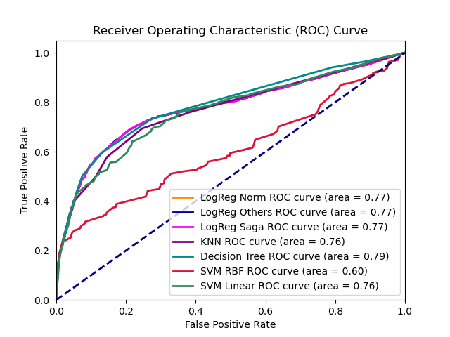
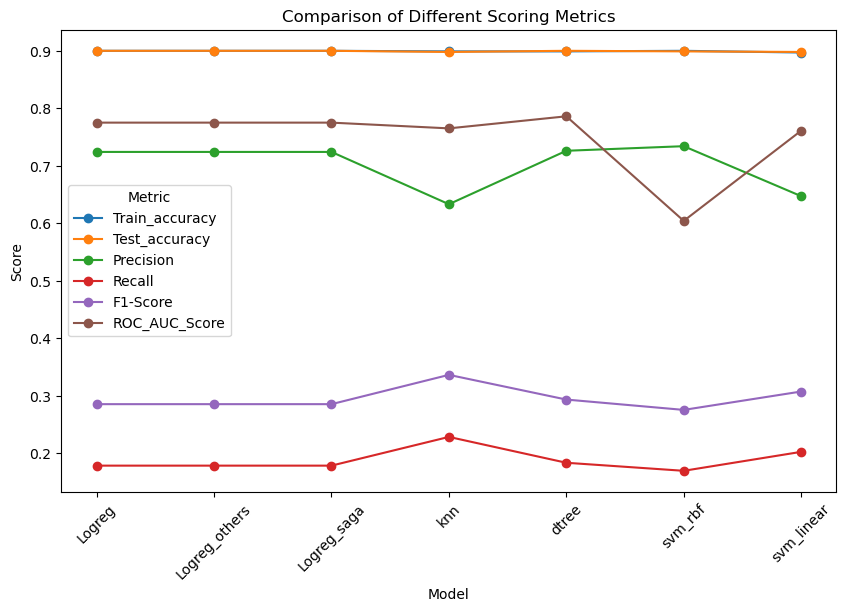
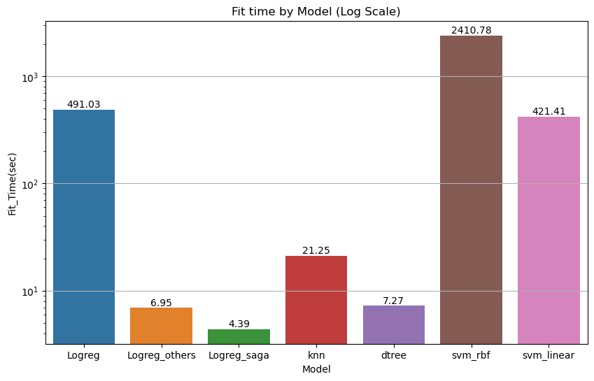

# Bank Marketing Campaign Analysis

## Overview

This project involves analyzing data from a bank marketing campaign to predict whether a client will subscribe to a term deposit. Various machine learning models were used, and their performance was evaluated using metrics like accuracy, precision, recall, F1-score, and ROC-AUC. Below is a summary of the findings and key insights.

## Models and Performance Evaluation

### Receiver Operating Characteristic (ROC) Curve

The ROC curve shows the performance of different models in distinguishing between the positive and negative classes. The area under the curve (AUC) gives an aggregate measure of performance across all classification thresholds. In this analysis:
- Logistic Regression models (Normal, Others, and Saga) showed the best AUC of 0.77.
- Decision Tree and KNN models followed with AUCs of 0.79 and 0.76, respectively.
- SVM with an RBF kernel had the lowest AUC at 0.60, indicating weaker performance.

### Comparison of Different Scoring Metrics

This plot compares different scoring metrics across models. Key takeaways include:
- Logistic Regression models maintain high accuracy and AUC scores but vary in recall and precision.
- The Decision Tree model shows the highest variance between training accuracy and test accuracy, indicating potential overfitting.
- SVM models generally perform well in terms of precision and recall but have a lower AUC score.

### Fit Time by Model

The fit time comparison indicates:
- SVM with an RBF kernel is the most computationally expensive, taking significantly longer to fit than other models.
- Logistic Regression models, especially with the Saga solver, are much faster.
- KNN and Decision Tree models also have relatively low fit times.

## Logistic Regression Feature Coefficients

### Summary of Feature Coefficients

The coefficients from the logistic regression model provide insights into the importance and direction of the relationship between each feature and the target variable (e.g., whether a customer will subscribe to a term deposit). Here’s a summary of the most important features based on their coefficients:

1. **`nr.employed` (-0.781):** 
   - This feature has the most significant negative impact on the prediction. A lower number of employees seems to increase the likelihood of subscribing to a term deposit. This might suggest that during periods of lower employment, customers are more likely to subscribe, potentially due to economic uncertainty or lower opportunity costs.

2. **`education_illiterate` (0.655):**
   - This feature has the largest positive impact on the likelihood of subscribing. Being classified as illiterate strongly increases the probability of subscribing to a term deposit. This might indicate that individuals with lower education levels may seek safer investment options like term deposits.

3. **`pdays` (-0.295):**
   - The number of days that passed after the client was last contacted has a moderate negative impact on the likelihood of subscription. The longer the duration since the last contact, the less likely a customer is to subscribe, possibly due to fading interest or the customer’s circumstances changing over time.

4. **`month_apr` (0.204):**
   - Being contacted in April positively influences the likelihood of subscribing. This could be due to seasonal factors, such as financial planning after the tax season or the timing of marketing campaigns.

5. **`job_admin.` (0.118):**
   - Customers with administrative jobs are more likely to subscribe, though the effect is relatively small. This may indicate that individuals in administrative roles are more conservative or financially cautious, preferring secure investment options.

6. **`marital_married` (-0.093):**
   - Being married slightly decreases the likelihood of subscribing to a term deposit. This might reflect that married individuals, potentially due to shared financial responsibilities or risk aversion, are less inclined to tie up funds in long-term deposits.

7. **`housing_yes` (-0.080):**
   - Customers who have a housing loan are slightly less likely to subscribe to a term deposit, possibly due to the financial obligations tied to their existing loan, reducing their disposable income available for investment.

8. **`education_basic.6y` (-0.075):**
   - Having basic education up to 6 years slightly decreases the likelihood of subscribing. This could indicate that those with basic education may be less familiar with or less inclined towards financial products like term deposits.

9. **`month_nov` (-0.048):**
   - Being contacted in November has a small negative effect on the likelihood of subscribing. This may be due to end-of-year financial pressures or a focus on holiday spending rather than long-term investments.

10. **`housing_no` (-0.038):**
    - Surprisingly, not having a housing loan also negatively impacts the likelihood of subscribing, although the effect is minimal. This might suggest that those without such obligations may feel less need to secure their finances with term deposits.

### Overall Implications:
The features with the most significant impact (either positively or negatively) suggest that both economic factors (such as employment and education) and timing (such as the month of contact) play critical roles in predicting a customer's likelihood of subscribing to a term deposit. Financial obligations like housing loans and the nature of one's job also influence the decision, albeit to a lesser extent.

## Conclusion

The analysis provides valuable insights into customer behavior and the effectiveness of different machine learning models in predicting term deposit subscriptions. Logistic Regression models show a balanced performance across metrics, while the SVM with an RBF kernel, although computationally intensive, may require further tuning to improve its predictive power.
